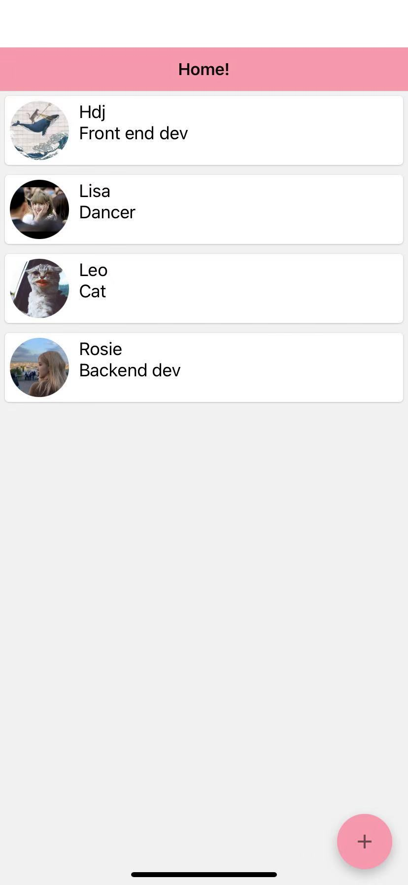

# Employee app

**Intro:**

a mobile application that allows a company to store details on an employee information such as name, position, salary, picture, etc.
includes camera access, images upload (cloudinary.com storage). Using React Native, Nodejs and express.js and mongoDB

**Pages:**

Employee List

Create/Update Employee's info

